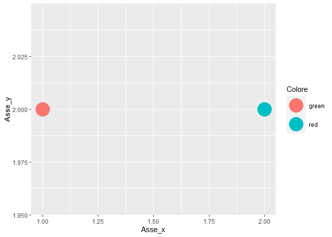
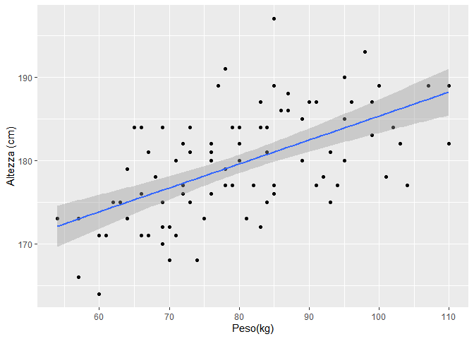

Visualizzazione Grafica
================

# Introduzione al concetto di “plot”.

Un grafico costruito partendo da dati viene comunemente chiamato plot.

Gli stessi dati possono essere rappresentati con tipologie diverse di
plot.

Quando si decide di presentare dati con un grafico, servono due
competenze:

-   Competenze tecniche per realizzare il plot in tutti i suoi dettagli
-   Competenze di comunicaziome per scegliere il plot giusto, i colori
    giusti etc.

|                             |
|-----------------------------|
| Cosa sapete del Daltonismo? |

### Quickplot

Quando Tidyverse è caricato, vale sempre la pena consultare la funzione
`qplot`. Questa funzione interpreta i dati immessi come argomento
(qualunque essi siano, qualunque la struttura) e rappresenta un plot che
secondo R è quello più appropriato, secondo un layout grafico standard.

Di solito, R non è capace di capire correttamente come vorremmo
rappresentare i dati, però il quick plot ci dà la sua prospettiva sulla
natura dei dati a disposizione.

``` r
rnorm(1000,25,5) %>% qplot()
```

<!-- -->

|                                                                                   |
|-----------------------------------------------------------------------------------|
| **SE USATE WINDOWS, SCARICATE IL PACCHETTO “CAIRO”**                              |
| A lezione vi spiegherò come settarlo per migliorare molto la qualità dei grafici. |

# La Grammatica della Grafica

Il comando cardine per plottare su Tidyverse è `ggplot`. `ggplot` usa
una sintassi abbastanza diversa da tutti gli altri comandi di R e
Tidyverse, ed è facile confondersi. La sintassi `ggplot` è ispirata ai
programmi di grafica vettoriale (programmi per la grafica commerciale) e
costruiscono il grafico “layer per layer”.

Combinata con la pipeline, la forma tipica di un codice per plottare dei
dati è:

``` r
Tabella %>% ggplot()+
  tipo_di_grafico(aes(asse_x = ...,
                      asse_y = ...,
                      fill/colore = ...,),
                  tratteggio = ...,
                  colore_della_linea = "colore",
                  altro = ...
  ) +
  ylab("Nome asse y")+
  xlab("Nome asse x")+
  theme(base_size = "...")+
  theme_test() +
  altro()
```

Ma questa è solo una forma comune di `ggplot`.

In verità diversi dettagli possono essere ordinati a `ggplot` in diversi
momenti della pipeline. La parola chiave, su cui è facile confondersi, è
`aes`. `aes` indica a `ggplot` da dove deve andare a prendere i valori
da rappresentare. Questi valori `aes` possono essere forniti anche come
argomento di `ggplot()`, anche se i risultati non sono del tutto
equivalenti sul piano tecnico, perchè…

-   se inserisco `aes` dentro `ggplot(aes(x=...,y=...))`, sto ordinando
    al programma di partire da uno “sfondo” che già contiene degli assi
    indicizzati (da dove a dove partono e finiscono gli assi) ai valori
    che sto indicando.
-   se inserisco `aes` dentro il tipo di grafico, è molto probabile che
    dovrò aggiungere una indicazione specifica per gli assi; però i
    valori non stanno indicizzando il layer sfondo, ma un layer
    ulteriore, che è il layer della figura geometrica. Questo mi
    consente di caricare più figure geometriche, per esempio più curve
    su diversi layers, sullo stesso sfondo. Io preferisco inserire i
    valori aes

Siccome la pipeline inizia con `Tabella` (Che può essere qualunque
termine a cui è assegnata una `tibble`), Tidyverse istruirà `ggplot` a
cercare, come termini che costituiranno `x` e `y` (cioé: gli assi), tra
le variabili della `Tabella`.

## aes() è FONDAMENTALE. Molti problemi di ggplot dipendono dal capire correttamente il significato di aes()

Ripassiamo un secondo la struttura fondamentale di un `ggplot`.

``` r
#prima di tutto va una tabella

Tabella %>%
  
  # poi va il comando ggplot. Questo servirà a fare partire il motore grafico.
  
  ggplot() +
  
  #d'ora in poi i comandi si inseriscono col simbolo "+", e non col pipe
  
  # si sceglie il timo di grafico
  
  tipo_di_grafico(
    # alcuni argomenti saranno forniti dentro aes()
    aes(y = colonna_1,
        x = colonna_2,
        fill = colonna_3),
    
    # notate la virgola dopo aes(...)
    
    # E poi partono altri argomenti FUORI da aes()
    
    size = 3,
    alpha = .5
    
    # ed infine si chiude il comando "tipo_di_grafico"
    
  )

# alpha significa trasparenza del colore fill. Di solito, color significa "colore del contorno" e fill "colore del riempimento".
```

La differenza fondamentale tra ciò che sta dentro `aes()` e ciò che sta
fuori da `aes()` è che ciò che sta dentro lo `aes()` è “dinamico” ed è
**indicizzato** ai valori che `ggplot()` legge dalla `Tabella`. Quando i
valori sono inseriti fuori da `aes()`, sono argomenti fissi. “Fisso” non
vuol dire unico, significa non indicizzato).

Facciamo un esempio:

``` r
# Qui il colore dei punti (non hanno un fill) sta dentro aes()
tibble(Asse_y = c(2,2),
       Asse_x = c(1,2),
       Colore = c("green","red")
       ) %>% ggplot() +
  geom_point(aes(y = Asse_y,
                 x = Asse_x,
                 color = Colore),
             size = 10) #+
```

<!-- -->

``` r
  #scale_color_manual(values = c("red","green"))

# Qui il colore dei punti sta fuori da aes
tibble(Asse_y = c(2,2),
       Asse_x = c(1,2),
       Colore = c("green","red")
       ) %>% ggplot() +
  geom_point(aes(y = Asse_y,
                 x = Asse_x),
             size = 10,
             color = "red"
             )
```

<!-- -->

``` r
tibble(Asse_y = c(2,2),
       Asse_x = c(1,2),
       Colore = c("green","red")
       ) %>% ggplot() +
  geom_point(aes(y = Asse_y,
                 x = Asse_x),
             size = 10,
             color = c("red","green")
             )
```

<!-- -->

# Grafici tipici

I grafici a barre ed i grafici di curve di densità, generalmente non
hanno bisogno di un valore per l’asse y (alternativamente, per l’asse x)
perché ci sono delle funzioni interne a `ggplot` che permettono di
“contare” le frequenze con cui ricorrono i valori.

### Grafico a barre

-   Per valori discreti

``` r
Test <- readxl::read_excel("base_dati_CICCHITELLI_excel/Test d'ingresso.xls")

Test %>%
  mutate(`Test d'ingresso` = `Test d'ingresso` %>% as.integer) %>%
  filter(`Test d'ingresso` != 0) %>%
  ggplot() +
    geom_histogram(
      aes(x=`Test d'ingresso`),
      fill="#69b3a2",
      color="#e9ecef",
      alpha=0.9,
      stat = "count"
      ) +
    ggtitle("TITOLO") +
    theme_grey(base_size = 20)
```

<!-- -->

-   Per valori continui

``` r
Tabella <- tibble(Altezze = rnorm(120,179,12))

Tabella %>%
  ggplot() +
    geom_histogram(
      aes(x=Altezze),
      bins = 10
      )
```

<!-- -->

### Curva di densità

``` r
Tabella %>%
  ggplot() +
    geom_density(
      aes(x=Altezze),
      color = "green",
      size = 3
      ) +
  theme_classic(base_size = 15)
```

<!-- --> \#\#\#
Scatterplot bi-dimensionale

``` r
Dati <- readxl::read_excel("base_dati_CICCHITELLI_excel/Dati antropometrici.xls")

Dati %>%
  ggplot(aes(`Peso(kg)`,
               `Altezza (cm)`)) +
  geom_point() -> p1

p1
```

<!-- -->

``` r
# notate la posizione di aes in questo caso

# metodo non parametrico
p1 + geom_smooth()
```

<!-- -->

``` r
# modello lineare
p1 + geom_smooth(method = lm)
```

<!-- -->

### Densità bi-dimensionale

Mentre `ggplot` provvede già dei buoni strumenti per grafici avanzati,
ci sono dei pacchetti specifici che aiutano la costruzione di plot
speciali seguendo la sintassi di `ggplot`.

La densità bi-dimensionale è un concetto molto più semplice di quanto
pensiate, e graficamente utile per comunicare distribuzioni continue
bi-variate.

``` r
pacman::p_load(ggdensity)

Dati %>%
  ggplot(aes(`Peso(kg)`,
               `Altezza (cm)`)) +
  geom_hdr() -> p2
p2
```

<!-- -->

``` r
p2 + geom_smooth()
```

<!-- -->

``` r
# commentate questo ultimo grafico
```

## BOXPLOTS E VIOLIN PLOTS

Questi grafici servono a visualizzare l’estensione e la densità tra
gruppi (discreti) e variabili continue:

-   Boxplot

``` r
mpg %>%
  mutate(class = fct_reorder(class, hwy, .fun='median')) %>%
  ggplot( aes(x=reorder(class, hwy), y=hwy, fill=class)) +
  geom_boxplot() +
  xlab("Tipo di autovettura") +
  ylab("Miglia per gallone") +
  theme_test(base_size = 16) +
    theme(legend.position="none")
```

<!-- -->

-   Violin plot

-   Boxplot

``` r
mpg %>%
  mutate(class = fct_reorder(class, hwy, .fun='median')) %>%
  ggplot(aes(x=reorder(class, hwy), y=hwy, fill=class)) +
  geom_violin() +
  xlab("Tipo di autovettura") +
  ylab("Miglia per gallone") +
  theme_test(base_size = 12) +
    theme(legend.position="none")
```

<!-- -->

| **Quando usare i boxplot, quando usare i violins?**                           |
|-------------------------------------------------------------------------------|
| Risposta breve: boxplot per articoli scientifici, violins in ogni altro caso. |

# Grafici ad Area

Troppo complicati da introdurre a lezione, ma fondamentali per:

-   Studi scientifici, demografici
-   Monitorare progetti lavorativi

Se avete capito la Grammatica della Grafica, potete provare a seguire
[questa guida](https://r-graph-gallery.com/136-stacked-area-chart.html).
