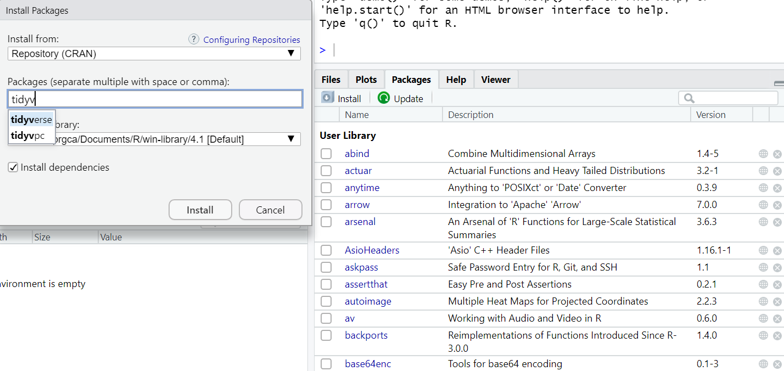

Introduzione
================

This is the teaching materials repository for:

-   Introduction to Data Science with R Tidyverse, for Social Research

for University of Catania, Department of Political and Social Sciences,
Spring 2022.

------------------------------------------------------------------------

Questo è l’hub del materiale didattico per il seminario:

-   Introduzione alla Data Science con R Tidyverse, per la Ricerca
    Sociale

per il Dipartimento di Science Politiche e Sociali dell’Università di
Catania, Secondo Semestre 2022.

------------------------------------------------------------------------

# Cos’è la Data Science

La Data Science è l’attività di produzione di valore applicando
**pratiche e metodi della ricerca scientifica** a qualunque tipo di
informazione statistica, cioé i “dati”. Il valore dei dati è
riconosciuto sia in ambito privato che in ambito pubblico.

La Data Science combina conoscenze che sono tipiche della **Ricerca
Statistica e della Scienza dell’Informazione**. Per esempio, in questo
seminario si imparerà ad **organizzare i dati secondo degli standard**
internazionali che rendono molto più agevole la comunicazione delle
informazioni.

### Perché alla Ricerca Sociale interessa la Data Science?

L’approccio moderno alla Ricerca Sociale prevede che uno studente, a
conclusione di una laurea magistrale, conosca almeno i principi di un
**linguaggio di programmazione scientifica**. Alcuni benefici:

-   La conoscenza di un linguaggio di programmazione scientifica è
    condizione necessaria per l’accesso al mondo della ricerca pubblica
    (Dottorati, Collaborazioni Tecniche, etc.) e privata (Ricerche
    sperimentali su comportamenti di consumo…). Tabelle e grafici sono
    elementi essenziali di qualunque pubblicazione scientifica.
-   Lo studente apprende i principi della comunicazione “tecnica” in
    ambito privatistico. In particolare lo studente apprenderà come
    “interrogare” dati organizzati in formato tabellare per supportare
    le proprie proposte.
-   Il settore pubblico è quello che beneficia maggiormente dalla
    dimestichezza coi dati, perché avendo un accesso privilegiato
    all’informazione è qui che si può generare e diffondere valore in un
    intero territorio.
-   Nuove professioni, es. “Data Journalist”…

## Perchè scegliere R Tidyverse come linguaggio di programmazione scientifica per la Ricerca Sociale?

R è un linguaggio di programmazione, ovverosia una sintassi logica di
**codici** per impartire ordini ad un computer ed ottenere dei risultati
organizzati secondo schemi tipici (ad esempio: tabelle).
[Tidyverse](https://www.tidyverse.org/) è un “dialetto” di R,
considerato particolarmente facile da capire sul piano della
**comprensione umana del codice**, ma anche molto **veloce sul piano
dell’efficienza** dei processi di calcolo per il computer.

Useremo anche una speciale interfaccia per R, che si chiama [R
Studio](https://www.rstudio.com/), e semplifica alcune operazioni di
gestione dei documenti di lavoro.

|                                                                                                                                                                                                                                                                                                                                                                                                                                                     |
|-----------------------------------------------------------------------------------------------------------------------------------------------------------------------------------------------------------------------------------------------------------------------------------------------------------------------------------------------------------------------------------------------------------------------------------------------------|
| CONCETTI FONDAMENTALI                                                                                                                                                                                                                                                                                                                                                                                                                               |
| Lato Utente: Momento in cui essere umano (utente) e computer (macchina) devono “interfacciarsi”. A volte la richiesta dell’utente è complessa e c’è la necessità di **disambiguare** il codice per permettere alla macchina di comprendere correttamente le istruzioni dell’utente. Nella ricerca sociale è molto importante che il codice con cui il ricercatore esegue operazioni ed analisi sui dati sia facile da capire per altri ricercatori. |
| Lato Macchina: Nei fatti è la velocità con cui la macchina esegue gli ordini. Nella ricerca sociale tradizionale di solito la velocità delle operazioni è istantanea, ma per problemi avanzati (es. Big Data) il ricercatore deve **ottimizzare il codice** anche per non forzare la macchina a fare più lavoro del necessario.                                                                                                                     |

R non è l’unico software di Data Science per la ricerca sociale. Il
linaguaggio più famoso è Python, ed una terza alternativa è Julia. Tutti
e tre sono **gratuiti**.

Stata è un linguaggio di programmazione scientifica per la ricerca
sociale a pagamento. SPSS non è un linguaggio ma una interfaccia che
“pre-confeziona” alcune operazioni tipiche e poi le converte in diverse
linguaggi. Infine, probabilmente conoscerete già Excel, che è uno
strumento utile per l’immissione dei dati in formato tabellare.

# Guida all’installazione di tutto il software necessario:

-   Prima di tutto, scaricate [l’ultima versione di R per il vostro
    sistema operativo](https://cran.stat.unipd.it/). Finito il download,
    installate il file.
-   Ripetete l’operazione con [R
    Studio](https://www.rstudio.com/products/rstudio/download/)

D’ora in poi, se volete lavorare su R, aprirete sempre R Studio.

A questo punto bisogna installare Tidyverse. Ci sono due modi egualmente
validi, ed un terzo metodo che è ancora più comodo, ma richiede di aver
capito i primi due.

-   Metodo 1: aprite R Studio. Il programma è diviso in quattro
    riquadri. Il riquadro in basso a destra ha cinque pagine:
    “Files,”Plots“,”Packages“,”Help" e “Viewer”. Basta cliccare su
    “Packages”. Spunterà una lista di “pacchetti”, che sono contenitori
    di codici. Sotto “Files” apparirà “Install”. Qui bisogna scrivere
    “tidyverse”, spuntare l’opzione per installare pure le sue
    dipendenze e poi cliccare su “Install”.

-   Metodo 2: Nello spazio chiamato “Console” (di base, si trova nel
    riquadro in basso a sinistra), scrivete questo codice:
    `install.packages("tidyverse")`, poi premete Invio.

Complimenti! Avete avete lanciato il vostro primo comando a R! Avete
enunciato un “ordine”: *Installa!* ed avete associato un complemento
oggetto: “tidyverse”.

Se tutto è andato a buon fine, R ha eseguito il comando: si è connesso
con Tidyverse ed ha installato il codice aggiutivo per “imparare” il
dialetto di Tidyverse, che in effetti si compone di diversi
sotto-pacchetti che arricchiranno il vostro repertorio con nuovi
comandi.

Prima di capire cosa fa il Metodo 3, bisogna ricordarsi che…

### ANCHE SE UN PACCHETTO È INSTALLATO,

### NON FUNZIONERÀ FINCHÈ NON È ATTIVATO.

### QUANDO CHIUDETE R STUDIO,

### TUTTI I PACCHETTI EXTRA SI DISATTIVANO DA SOLI

Ne consegue che: per lanciare comandi in “dialetto Tydiverse” bisogna
prima attivare “Tidyverse”.

Per attivare Tidyverse, bisogna lanciare il comando:

`library("tidyverse")`.

Ora siete pronti per il Metodo 3.

-   Metodo 3: Installate “pacman”. Dovreste esserne capaci da soli. Ora
    lanciate il comando: `pacman::p_load("tidyverse")`

|                                                                                                                                                                                                                                   |
|-----------------------------------------------------------------------------------------------------------------------------------------------------------------------------------------------------------------------------------|
| In questo caso non è stato necessario attivare “pacman”, perché abbiamo anteposto `pacman::` al nome del comando. Anteporre il nome del pacchetto e due volte due punti prima di un comando è utile per *disambiguare* il codice. |

`p_load("nome_del_pacchetto")` fa due cose: se il pacchetto non è
installato, lo installa e poi lo attiva, se è già installato, lo attiva
e basta. Se il pacchetto è già attivato, pacman non fa niente. Potete
chiedere a pacman di attivarvi più pacchetti in un solo comando in
questo modo:
`p_load("nome_del_pacchetto_1","nome_del_pacchetto_2","nome_del_pacchetto_etcetc")`.
Comodo, no?

## A che serve Github?

Github è un sito che funge da deposito di codici ed altro materiale
informatico utile. Una cartella di documenti si chiama “Repository”.
Github viene organizzato secondo il linguaggio “Git”, la cui conoscenza
non è necessaria per questo seminario.

Idealmente, se a qualcuno di voi interessa imparare come usare Github,
vi sarà possibile scaricare tutto il materiale da lezione dentro una
cartella del vostro computer usando i comandi di R Studio.
Alternativamente dovreste poterli scaricare uno alla volta.

|                                                                                                                                                                                                                                |
|--------------------------------------------------------------------------------------------------------------------------------------------------------------------------------------------------------------------------------|
| Git e Github sono utili nel mondo della ricerca perché consenstono di lavorare in parallelo su documenti informatici condivisi in un team di ricerca, creando versioni parallele dello stesso progetto e condividendo risorse. |
| Il linguaggio equivalente per la scrittura di articoli scientifici si chiama LateX (si pronuncia: LateCh; l’ultima lettera è una Chi greca).                                                                                   |

# Struttura delle Lezioni

Il Seminario si compone di 6 Lezioni:

1.  Formati e strutture dati elementari su R
2.  Comandi di calcolo aritmatico e logico
3.  Organizzazione nel formato tabellare
4.  Principi di automazione dei comandi
5.  Tecniche di visualizzazione
6.  Tecniche di analisi multivariata

Che troverete a [questo link](ciao)

## Esami

FILL FILL FILL
